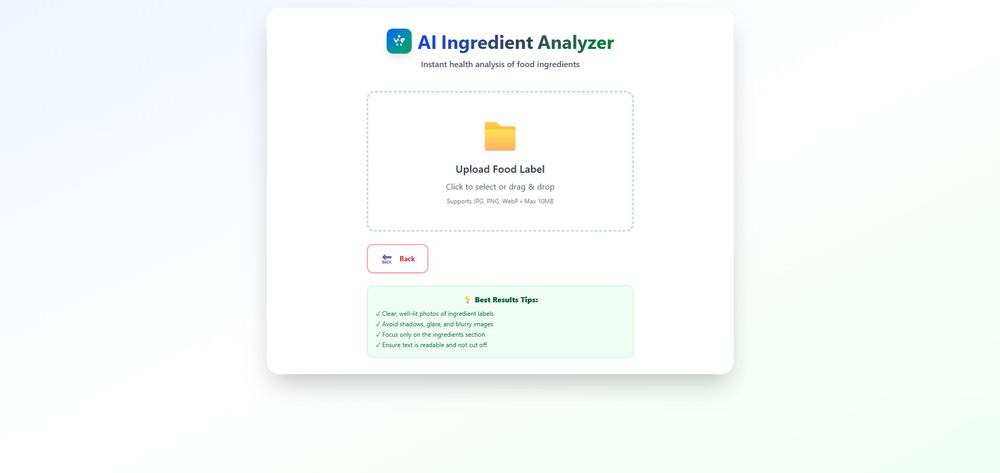
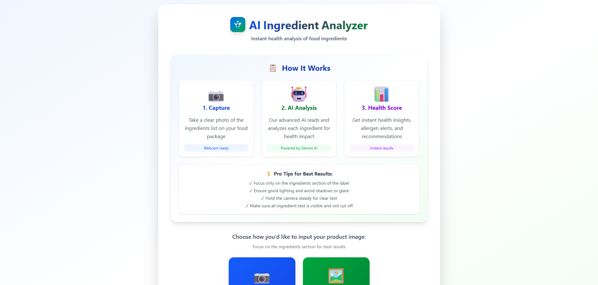

# 🍉 Ingredient Checker

Photograph a food label, get a plain-language health read on what's in it.

The app runs OCR over the label image, pulls out the ingredients list, and asks
an LLM to score each ingredient — plus allergen detection and an overall health
score.

> Government Engineering College, Rajkot

| Upload | Results |
| --- | --- |
|  |  |

---

## How it works

```
Browser (React + Vite)
  │  base64 JPEG  ->  POST /api/analyze
  ▼
Express API
  ├─ sharp            resize / re-encode the image
  ├─ Gemini Vision    OCR  (falls back to Tesseract when no key or on failure)
  ├─ helpers          isolate the ingredients section from the OCR text
  ├─ node-cache       48h cache keyed on the ingredient text
  └─ Groq             per-ingredient Good / Bad / Neutral analysis
```

## Requirements

- Node.js 18+
- A [Groq API key](https://console.groq.com/keys) — **required**
- A [Gemini API key](https://aistudio.google.com/app/apikey) — optional, but
  without it OCR falls back to Tesseract, which is slower and less accurate

## Local development

### Backend

```bash
cd back-end
npm install
cp .env.example .env      # then fill in GROQ_API_KEY
npm run dev               # http://localhost:5000
```

### Frontend

```bash
cd front-end
npm install
npm run dev               # http://localhost:5173
```

The frontend reads `VITE_BACKEND_URL` from `front-end/.env` and falls back to
`http://localhost:5000`, so local development works with no extra setup.

## Environment variables

### `back-end/.env`

| Variable | Required | Default | Purpose |
| --- | --- | --- | --- |
| `GROQ_API_KEY` | ✅ | — | Ingredient analysis. The server exits on startup without it. |
| `GEMINI_API_KEY` | — | — | Enables Gemini Vision OCR; falls back to Tesseract when unset. |
| `GROQ_MODEL` | — | `llama-3.3-70b-versatile` | Override when Groq retires a model id. |
| `GROQ_BASE_URL` | — | Groq chat-completions endpoint | Override for testing. |
| `PORT` | — | `5000` | Listen port. |
| `NODE_ENV` | — | `development` | `development` adds debug detail to error responses. |

### `front-end/.env`

| Variable | Required | Default | Purpose |
| --- | --- | --- | --- |
| `VITE_BACKEND_URL` | — | `http://localhost:5000` | Base URL of the API. |

> ⚠️ Vite inlines `VITE_*` variables **at build time**. Setting the variable only
> on your host's runtime dashboard does nothing — it has to be present when
> `npm run build` runs, and changing it means rebuilding.

## Docker

```bash
cp .env.example .env       # fill in GROQ_API_KEY
docker compose up --build
```

- Frontend: http://localhost:8080
- Backend: http://localhost:5000

`VITE_BACKEND_URL` is passed to the frontend image as a build arg, so point it at
the URL the **browser** will use — not an internal compose hostname.

## API

### `GET /health`

```json
{ "status": "OK", "timestamp": "2025-01-01T00:00:00.000Z" }
```

### `POST /api/analyze`

```json
{
  "image": "data:image/jpeg;base64,...",
  "fastMode": true,
  "isMobile": false
}
```

Success (`200`):

```json
{
  "ingredientsText": "sugar, water, salt, ...",
  "analysis": [
    {
      "ingredient": "sugar",
      "status": "Bad",
      "reason": "High glycemic index...",
      "concerns": ["diabetes", "obesity"]
    }
  ],
  "allergens": ["dairy"],
  "healthScore": { "score": 72, "breakdown": { "good": 4, "bad": 2, "neutral": 3 } },
  "harmfulIngredients": [],
  "ocrConfidence": 88,
  "ocrMethod": "gemini_vision",
  "processingTime": 3140,
  "aiTime": 1890,
  "cached": false
}
```

Errors carry a machine-readable `code`:

| Status | Code | Meaning |
| --- | --- | --- |
| 400 | `NO_REQUEST_BODY`, `INVALID_IMAGE_FIELD`, `INVALID_BASE64` | Malformed request. |
| 400 | `IMAGE_TOO_SMALL`, `OCR_FAILED`, `NO_TEXT_DETECTED` | Image unreadable. |
| 400 | `INSUFFICIENT_INGREDIENTS` | Text found, but no ingredients list in it. |
| 413 | `IMAGE_TOO_LARGE` | Over 10MB decoded. |
| 422 | `INVALID_IMAGE` | Readable, but not a food ingredient label. |
| 429 | — | Rate limited (100 requests / 15 min per IP on `/api`). |
| 502 | `GROQ_*` | Upstream AI failure. |
| 504 | `GROQ_TIMEOUT` | Upstream AI timed out. |

## Smoke test

With the backend running:

```bash
cd back-end
npm run smoke-test                        # generates a blank image (expects 422)
node scripts/test-image.js ../upload.png  # or pass a real label image
```

## Project layout

```
back-end/
  server.js              Express app and the /api/analyze route
  optimized-ocr.js       Gemini Vision + Tesseract OCR, label validation
  services/groqService.js  Groq call, JSON extraction and salvage
  utils/                 ingredient extraction, allergens, scoring, cache
  configuration/         env loading and tunable constants
  middleware/            error -> HTTP status mapping
front-end/
  src/App.jsx            capture/upload flow and request handling
  src/config.js          resolves the backend URL
  src/components/        camera, uploader, preview, results
  src/utils/imageUtils.js  client-side compression and device detection
```
